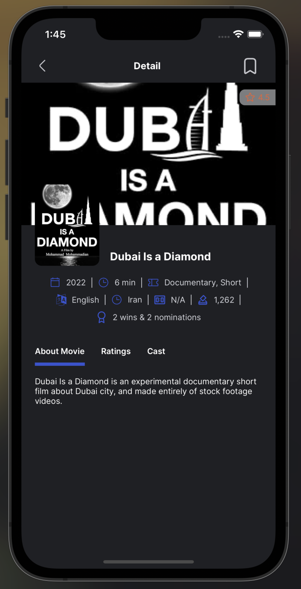

# # moviepal - Mobile Application for Movies


### MedMindApp is a React Native mobile application that provides users with collections of movies. The app follows the MVC (Model-View-Controller) code pattern to ensure a well-organized and maintainable codebase.

## Features

- Movies List: Showcases a diverse array of movie genres presented randomly to the user.

- Search Feature: Offers a robust search functionality, enabling users to effortlessly find movies by title, genre, or actor.

- Color Mode: Provides users with the flexibility to choose between light, dark, or the system's default theme, enhancing visual comfort and personalization.

- User-Friendly Interface: Designed with simplicity and ease of use in mind, ensuring a seamless and intuitive movie searching experience.

- MVC Architecture: The app is structured following the MVC (Model-View-Controller) pattern, promoting separation of concerns and maintainability.

## Tech Used

- React Native
- Redux

## How to build

Default branch:

```
$ master
```

Clone this repo to your machine:

```
$ git clone https://github.com/frankelly001/moviepal.git
```

```
$ cd moviepal
```

Install dependencies:

```
$ yarn install
```

If you are running app on iOS:

```
$ cd ios
```

```
$ pod install
```

Return to the project main directory:

```
$ cd ..
```

To run on android:

```
$ react-native run-android
```

To run on iOS:

```
$ react-native run-ios
```

## Usage

- Launch the MedMindApp on your mobile device or emulator, it presents you list of movies at random, you can also search and check the selected movie detail

<p float="left">





</p>

<br />

Built by @Frankelly
Email: Frankelly344@gmail.com
